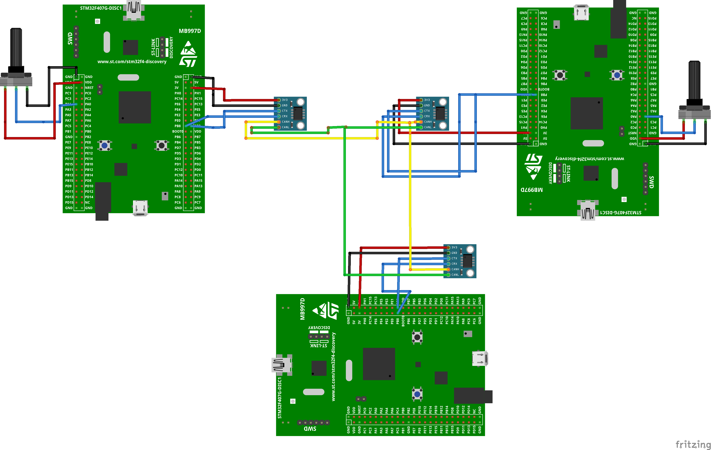

# CAN-Bus-STM32
## Overview

This project implements a Controller Area Network (CAN) between three STM32F407G boards: two nodes and a gateway. Each node is connected to a potentiometer. When the button on the STM32F407G node board is pressed, the node reads the ADC value from the potentiometer, turns on the integrated LEDs based on the value, and transmits this information via CAN to the gateway board. The receiving node then turns on the same LEDs accordingly. The gateway acts as a receiver, and the two nodes are transmitters.

## Features
- **Two nodes connected to potentiometers .**  
- **One gateway node that receives messages.**  
- **Real-time data transmission using the CAN protocol.**   
- **LED visualization of ADC values across nodes.**  
- **Reliable CAN message handling between nodes.**  

## Requirements
### Hardware

- 3x STM32F407G-based development boards  
- 2x Potentiometers  
- CAN transceivers (e.g., MCP2551, SN65HVD230)  
- Connecting wires and breadboard   

### Software  
- STM32CubeIDE  
- STM32 HAL Library  

## Project Development
### Hardware Connections

- Connect a potentiometer to each of the two nodes using wires.
- Connect the CAN transceivers to all three STM32F407G boards.
- Ensure correct wiring of CAN High (CANH) and CAN Low (CANL) lines.

### Software Setup
- Install STM32CubeIDE and configure the project for STM32F407G. 
- Configure the clock.
- Enable CAN peripheral in STM32CubeMX.  
- Configure ADC for potentiometer readings and GPIO for button input with interrupt handling.  
- Implement the code for both the nodes and the gateway.  
- Set up CAN message transmission, reception, and filtering .  

## Future Improvements
-Extend functionality to handle more complex sensor data beyond potentiometer readings

